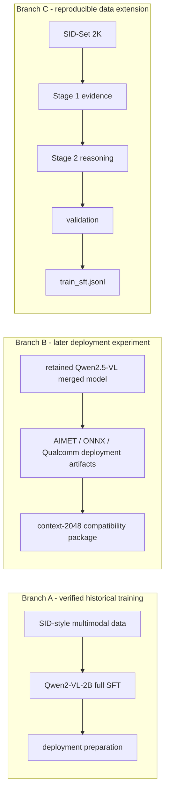

# LPCVC Track 3: ThinkFake-Style SFT and Qualcomm Deployment Pipeline

An end-to-end multimodal AI-generated image detection project covering structured forensic supervision, Qwen-VL fine-tuning history, and Qualcomm-oriented edge-AI deployment experiments.
**Computer Vision** · **Deepfake Detection** · **Multimodal SFT** · **Qwen-VL** · **AIMET / ONNX / Qualcomm**
Jump to [Quick Start](#quick-start) to run the small reproducible SID-Set smoke test.

## Overview

This repository documents a public source-code workflow for preparing multimodal real/fake image supervision and connecting that data to Qwen-VL training and edge deployment work. The most reproducible part is the SID-Set 2K annotation pipeline, which creates structured ThinkFake-style examples for multimodal supervised fine-tuning.

The project history has three branches:


The checked files do not prove that these three branches formed one continuous competition run.

## Key Capabilities

- Balanced SID-Set preparation with 1000 real and 1000 fully synthetic images.
- Two-stage visual forensic annotation with eight structured criteria.
- Multimodal SFT JSONL construction for Qwen-VL-style training.
- Historical MS-Swift Qwen2-VL-2B full fine-tuning evidence.
- Historical AIMET, ONNX, and Qualcomm-oriented deployment work.

## Why This Project Matters

- It turns binary real/fake labels into structured visual forensic supervision.
- It builds multimodal SFT records that preserve image references, prompts, rationales, and final judgments.
- It demonstrates practical Qwen-VL fine-tuning experience on image-grounded detection data.
- It connects model adaptation work to edge-AI deployment concepts such as AIMET preparation, ONNX export, context binaries, serialized binaries, raw runtime inputs, and configuration files.

## Public Repository Structure

```text
.
|-- README.md
|-- Dockerfile
|-- scripts/
|   |-- download_sidset_2k.py
|   |-- prepare_sidset_2k.py
|   |-- generate_stage1.py
|   |-- generate_stage2.py
|   |-- validate_json_outputs.py
|   `-- build_train_jsonl.py
|-- configs/
|   `-- prompts/
|-- docker_ms_swift/
```

Historical logs, datasets, model weights, Qualcomm proprietary components, deployment binaries, and competition submission packages are not included in the public repository.

## Reproducible SID-Set 2K Pipeline

The reproducible data extension performs:

```text
SID-Set schema inspection
  -> balanced sampling of 1000 real and 1000 fully synthetic images
  -> tampered images excluded by default
  -> RGB JPEG conversion
  -> manifest generation
  -> Stage 1 visual evidence extraction
  -> Stage 2 synthesis using Stage 1 outputs
  -> JSON validation
  -> train_sft.jsonl
```

The pipeline handles SID-Set labels as real, fully synthetic, or tampered. By default, tampered images are not included in the fake class; the fake class is built from fully synthetic images.

## Stage 1 and Stage 2

Stage 1 reads `manifest.jsonl`, sends each image to a vision-capable API model, and writes preliminary evidence to `stage1_valid.jsonl`.

Stage 2 reads and uses `stage1_valid.jsonl`. It synthesizes the three Stage 1 outputs into a structured eight-criterion JSON judgment:

```text
image
  -> Stage 1 preliminary visual evidence
  -> Stage 2 structured eight-criterion reasoning
  -> final real/fake judgment
```

Both stages support resume mode for interrupted annotation jobs.

## train_sft.jsonl Schema

`train_sft.jsonl` is multimodal SFT data, not merely a binary-label file. Each record contains an image reference, a user instruction, a structured assistant response, preserved Stage 1 evidence, and metadata about the annotation run.

```json
{
  "id": "sidset_real_000001",
  "image": "dataset/SID_Set_2k/real/sidset_real_000001.jpg",
  "label": "REAL",
  "messages": [
    {"role": "user", "content": "<image>\nIs this image real or generated by AI?..."},
    {"role": "assistant", "content": "{\"per_criterion\":[...],\"overall_likelihood\":\"Real\"}"}
  ],
  "thinkfake_stage1": {
    "prompt1": "...",
    "prompt2": "...",
    "prompt3": "..."
  },
  "generator_model": "annotation-model-name",
  "reasoning_effort": "reasoning-setting"
}
```

Generated rationales are synthetic supervision and may contain hallucinated or weakly grounded forensic observations. Schema validation and manual sampling are required before training.

## Historical Qwen2-VL-2B SFT

A historical local SFT log documented MS-Swift training with `Qwen/Qwen2-VL-2B-Instruct`, full tuning, `freeze_vit=true`, `freeze_aligner=false`, `bf16=true`, 3 epochs, batch size 1, gradient accumulation 16, eval steps 100, save steps 100, max length 2048, max new tokens 2048, and learning rate `2e-5`.

This is Qwen2-VL-2B full SFT history. It is not documented here as Qwen2.5-VL LoRA training.

## Later Qwen2.5 Deployment Experiment

Historical local artifacts include a merged Qwen2.5-VL model directory whose name references checkpoint 100. Related deployment work included a merged float16 Qwen2.5-VL model, AIMET / ONNX / Qualcomm-oriented deployment artifacts, a 3072-to-2048 context compatibility rollback, and local package/file-structure validation.

This is described as a later deployment experiment. The public repository does not establish that Qwen2.5-VL was the official competition submission, that the LoRA training command was verified, that checkpoint 100 was the best checkpoint, or that every Qualcomm AI Hub or device validation stage succeeded.

## Quick Start

```bash
git clone https://github.com/robin-1234/LPCVC-Track3-Pipeline.git
cd LPCVC-Track3-Pipeline
python -m venv .venv
source .venv/bin/activate
python -m pip install --upgrade pip
python -m pip install datasets huggingface_hub pillow tqdm openai
```

Authenticate with Hugging Face if required:

```bash
huggingface-cli login
```

Use portable paths for the dataset workspace:

```bash
PROJECT_ROOT="/path/to/LPCVC-Track3"
SIDSET_ROOT="$PROJECT_ROOT/dataset/SID_Set_2k"
cd "$PROJECT_ROOT"
```

Scan the upstream schema, download the balanced 2K subset, then create a four-image smoke workspace:

```bash
python scripts/download_sidset_2k.py \
  --hf_dataset saberzl/SID_Set \
  --output_root "$SIDSET_ROOT" \
  --scan_only
python scripts/download_sidset_2k.py \
  --hf_dataset saberzl/SID_Set \
  --output_root "$SIDSET_ROOT" \
  --num_real 1000 \
  --num_fake 1000 \
  --seed 42 \
  --resume
python scripts/prepare_sidset_2k.py \
  --sidset_root "$SIDSET_ROOT" \
  --output_dir output_sidset_smoke \
  --num_real 2 \
  --num_fake 2 \
  --seed 42 \
  --resume
```

Tampered images are excluded by default. The smoke test uses 2 real and 2 fake images.

Run Stage 1, Stage 2, validation, and SFT JSONL generation:

```bash
export OPENAI_API_KEY="<your-api-key>"
export OPENAI_MODEL="<your-available-vision-model>"
python scripts/generate_stage1.py \
  --output_dir output_sidset_smoke \
  --model "$OPENAI_MODEL" \
  --api_key_env OPENAI_API_KEY \
  --reasoning_effort xhigh \
  --max_output_tokens_stage1 500 \
  --resume
python scripts/generate_stage2.py \
  --output_dir output_sidset_smoke \
  --model "$OPENAI_MODEL" \
  --api_key_env OPENAI_API_KEY \
  --reasoning_effort xhigh \
  --max_output_tokens_stage2 1200 \
  --resume
python scripts/validate_json_outputs.py \
  --output_dir output_sidset_smoke
python scripts/build_train_jsonl.py \
  --output_dir output_sidset_smoke
```

Stage 1 requires a model that supports image input. Stage 2 consumes `stage1_valid.jsonl` and requires a model suitable for text synthesis into strict JSON. Run the smoke test before launching a full annotation job; Stage 1 and Stage 2 call external APIs and can incur cost.

## Output Files

A completed annotation workspace contains:

```text
output_sidset_smoke/
|-- manifest.jsonl
|-- stage1_raw.jsonl
|-- stage1_valid.jsonl
|-- stage1_failed.jsonl
|-- stage2_raw.jsonl
|-- stage2_valid.jsonl
|-- stage2_invalid.jsonl
|-- train_sft.jsonl
`-- logs/
```

Regenerate or normalize manifests if they contain absolute paths from another machine.

## Publication Boundaries

This repository is intended for public source-code and documentation review. It does not include datasets, model checkpoints, generated annotations, proprietary Qualcomm tooling, deployment binaries, or competition submission packages.

Do not commit API keys, Hugging Face tokens, generated private manifests, paid API outputs, model weights, or deployment binaries unless their licenses and competition rules allow release.

## Limitations

- No official competition placement is stated because this public repository does not include an official leaderboard result file.
- The SID-Set 2K extension should not be treated as proof of the exact original competition training dataset.
- Synthetic annotation rationales require human sampling and quality control before SFT.
- The historical Qwen2-VL-2B SFT and Qwen2.5 deployment work are documented as project history, not as a one-command public reproduction.
- Qualcomm deployment reproduction requires external proprietary tooling and hardware or cloud validation access.

## Licenses and Acknowledgements

Check and comply with the licenses and terms for LPCVC materials, SID-Set, Qwen/Qwen-VL models, MS-Swift, AIMET, Qualcomm AI Hub, QNN SDK, and OpenAI API usage.

This project builds on LPCVC Track 3, SID-Set, ThinkFake-style forensic annotation ideas, Qwen-VL models, MS-Swift, AIMET/ONNX deployment tooling, Qualcomm edge-AI workflows, and OpenAI-supported multimodal annotation.
